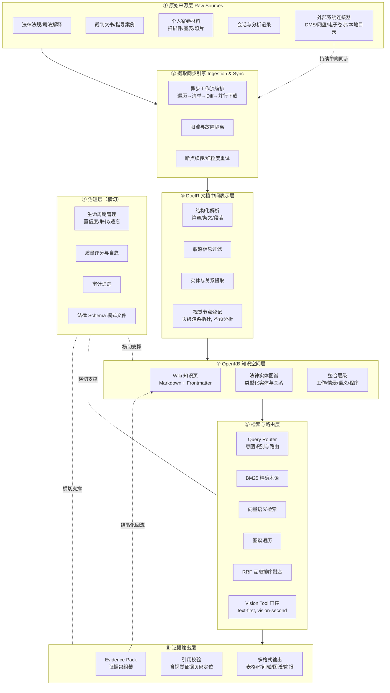
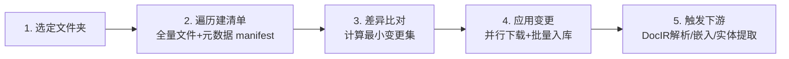
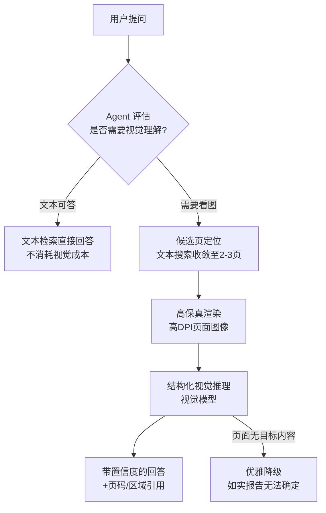
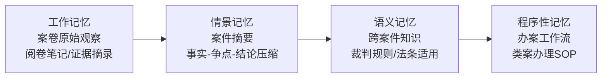
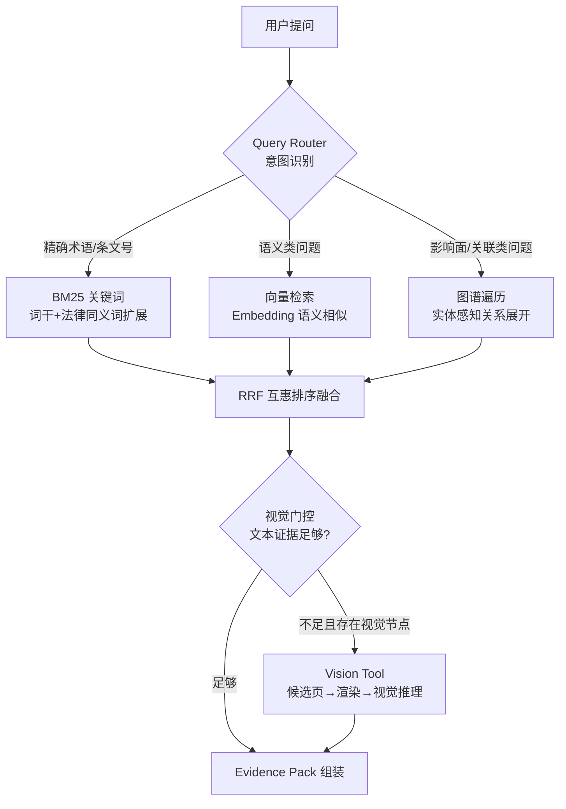
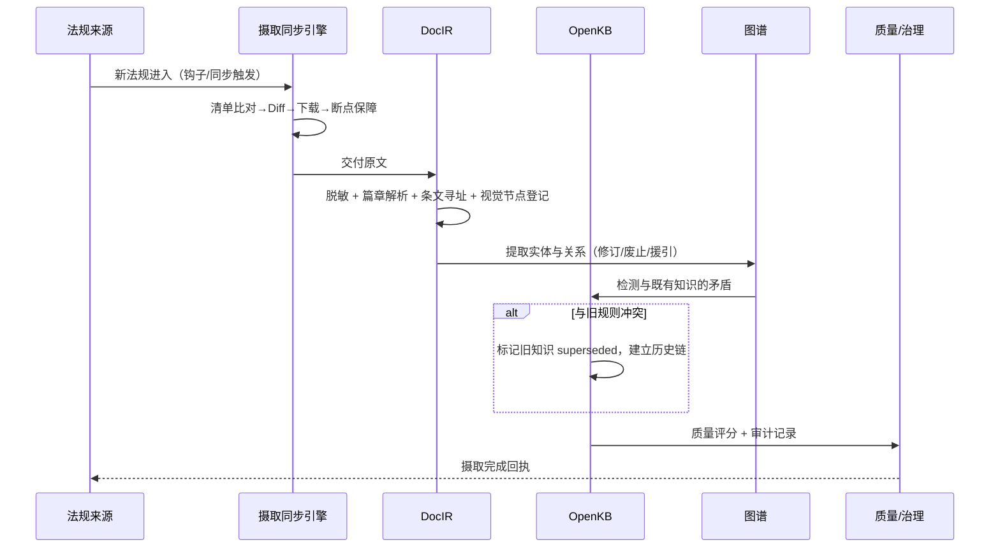
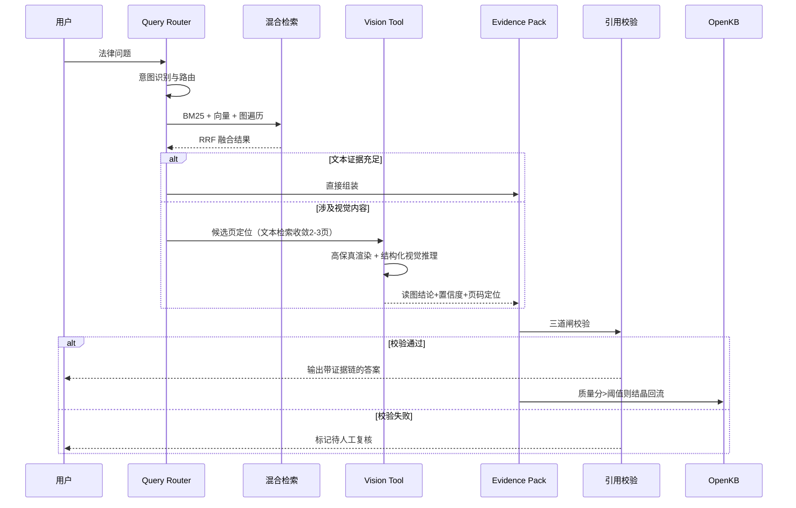

# 北大法宝法律智能知识库技术方案

> 面向个人法律知识管理与法律案卷处理的知识工程原型
> 设计理念：LLM Wiki v2（Karpathy 构想 + agentmemory 生产经验）× Harvey 工程实践（按需视觉理解 / 规模化摄取同步）× 法宝现有架构（DocIR / OpenKB / Query Router / Evidence Pack / 引用校验）
>
> 参考资料：
> - Harvey, *Building Image Understanding for Legal Documents* — https://www.harvey.ai/blog/building-image-understanding-for-legal-documents
> - Harvey, *Building a New File Ingestion System to Scale Firm Knowledge* — https://www.harvey.ai/blog/building-new-file-ingestion-system-to-scale-firm-knowledge

---

## 1. 设计背景与核心理念

### 1.1 从 RAG 到 Wiki：停止重复推导，开始编译

传统法律检索的本质是"检索并遗忘"——每次提问都重新召回、重新推理，答案随会话结束而消散。LLM Wiki 的核心主张是：**把每一次检索、每一次案卷分析的推理成果"编译"进一个持续积累、持续修正的知识体**，让知识库从"文档的仓库"进化为"会成长的法律认知模型"。

对法律场景而言，这一理念有三重特殊价值：

1. **法律工作高度重复**：同类案由的争议焦点、法条适用路径、裁判规则会被反复推导。编译一次，终身复用。
2. **法律知识强时效**：法规修订、司法解释更替、指导性案例发布——Wiki 的"取代"与"版本化"机制天然契合法律的时效性管理。
3. **法律输出强问责**：每一个结论都必须可追溯、可核验。Wiki 的置信度评分、审计追踪与法宝已有的引用校验形成合力。

### 1.2 Harvey 工程实践的两条关键经验

**经验一：视觉理解是工具，不是流水线步骤。** 法律文档不只是文字——证据中的财务图表、现场照片、签名页、手写批注、复杂表格，经 OCR 纯文本化后会丢失关键语义。Harvey 的实践表明：在摄取时为每张图片生成描述既昂贵、有损又常常脱离上下文；正确做法是**按需视觉分析**——Agent 在查询时判断"这个问题需要看图"，先经文本检索定位候选页（500 页文档毫秒级收敛到 2–3 页），再高保真渲染并调用视觉模型做结构化推理，且文本能回答的问题绝不动用视觉（图像分析成本约为文本生成的 50 倍，而 90% 的图像与查询无关）。

**经验二：机构知识的规模来自摄取基础设施，而非上传按钮。** 律所的知识沉淀在文档管理系统（DMS）中，动辄百万级文件。手动逐文件上传不可持续，上传后源文件更新又导致知识陈旧。Harvey 的解法是：文件夹级一键导入 + 持续单向同步，底层由异步工作流编排（Temporal 模式）驱动——遍历建清单、差异比对、并行下载、断点续传、细粒度重试、全局限流，最后触发下游解析（分块/嵌入/OCR）。

这两条经验恰好补强法宝的两个薄弱环节：**案卷材料中大量扫描件与图表证据的理解能力**，以及**知识来源从"手动喂料"升级为"持续同步"的工程化通路**。

### 1.3 理念映射总表

| 理念来源 | 核心机制 | 法宝知识库落点 |
|---|---|---|
| LLM Wiki | 三层架构（原始源 / Wiki / 模式） | 原始文档层 / OpenKB 知识层 / 法律模式文件（Schema） |
| LLM Wiki | 知识生命周期（置信度、取代、遗忘） | 法规时效管理 + 知识点置信度 + 保留衰减曲线 |
| LLM Wiki | 整合层级（工作→情景→语义→程序记忆） | 案卷观察→案件摘要→裁判规则→办案工作流 |
| LLM Wiki | 类型化知识图谱 | 法律实体图谱（法规/条文/案例/案由/主体） |
| LLM Wiki | 混合搜索（BM25+向量+图遍历+RRF） | Query Router 的多路召回与融合 |
| LLM Wiki | 事件驱动钩子 | 摄取、查询、写入、定时维护的自动化流水线 |
| LLM Wiki | 质量评分与自我修复 | 引用校验 + 知识健康度治理 |
| LLM Wiki | 结晶化（Crystallization） | Evidence Pack 沉淀为新知识页 |
| LLM Wiki | 隐私治理与审计 | 敏感信息过滤 + 全量操作审计 |
| LLM Wiki | 模式文件是真正的产品 | 法律领域 Schema（实体/关系/摄取/质量标准） |
| **Harvey** | **按需视觉分析工具（text-first, vision-second）** | **DocIR 视觉节点 + Vision Tool + 视觉路由门控** |
| **Harvey** | **异步摄取编排（清单/差异/并行/限流）** | **摄取同步引擎（文件夹导入 + 单向同步 + Diff 算法）** |

---

## 2. 总体架构



**架构要点**：相较 v1，新增两个横切能力——**摄取同步引擎**解决"知识从哪来、如何保鲜"的工程问题（与生命周期的"取代"机制联动：源文件变更触发知识刷新）；**Vision Tool 门控**解决"图像证据如何被理解"的能力问题（视觉分析不进摄取流水线，而是查询时的按需工具）。Evidence Pack 通过"结晶化"回流为新的 Wiki 知识页，形成知识复利闭环。

---

## 3. 核心子系统设计

### 3.1 DocIR：文档中间表示层

DocIR 是整个知识库的底座，负责把异构法律文档统一为可计算的结构化表示。

**结构规范（按文档类型分化）：**

| 文档类型 | DocIR 结构 |
|---|---|
| 法律法规 | 法规 → 编/章/节 → 条文（条/款/项），每条携带：效力级别、时效状态、施行日期、修订历史指针 |
| 裁判文书 | 文书 → 首部/事实/理由/判决主文/尾部，标注：案号、案由、法院层级、审判程序、争议焦点、裁判要旨 |
| 案卷材料 | 卷 → 证据/笔录/文书 → 页，标注：证据类型、证明对象、质证状态、**视觉内容清单** |
| 会话记录 | 会话 → 问题/推理链/结论，标注：引用来源、质量评分 |

**关键设计：**

- **条文级寻址**：每个 DocIR 节点拥有全局唯一 ID（如 `law://民法典/合同编/第577条`），这是引用校验与图谱锚定的基础。
- **视觉节点登记（不预分析）**：解析时识别页面中的视觉内容（图表、签名区、照片、手写批注、复杂表格），在 DocIR 中登记为视觉节点——只记录**页码、位置、类型、周边文本锚点和高保真渲染指针**，不生成图像描述。理由（Harvey 经验）：脱离问题上下文的图像描述既昂贵又有损，且 90% 的视觉内容永远不会被查询。
- **摄取前置过滤**：任何内容进入 DocIR 之前自动脱敏——身份证号、银行卡号、当事人隐私信息按规则引擎+NER 双路识别屏蔽，全程无需人工介入。
- **实体联合提取**：LLM 在解析时不只生成摘要，而是同步产出结构化实体（法规、条文、案例、法院、当事人、案由、证据、争议焦点）及类型化关系，直接写入知识图谱。

### 3.2 摄取同步引擎：规模化知识的工程通路（新增）

知识库的瓶颈不在检索而在"喂料"。借鉴 Harvey 的文件摄取架构，法宝的摄取同步引擎采用**异步工作流编排**模式（Temporal 式，或等价的持久化任务编排框架），支持两条通路：

**通路一：文件夹级批量导入。** 用户从本地目录、网盘、律所 DMS、电子卷宗系统选定任意文件夹，一键导入完整层级——含嵌套子目录、全部文件及元数据，目标支持单批次十万级文件。

**通路二：持续单向同步。** 将某文件夹/案件目录挂接为同步源，源端文件增删改后，系统自动侦测并同步变更——律师在 DMS 里更新的合同模板，下一次同步即在法宝生效，**从机制上消灭"知识陈旧"**（与 3.5 生命周期的"取代"机制衔接：同步触发的内容变更自动进入矛盾检测与取代流程）。

**五步工作流：**



**工程要点（对照 Harvey 实践）：**

| 挑战 | 设计 |
|---|---|
| 编排可靠性 | 每个外部 API 请求是独立的持久化活动（activity），享用细粒度自动重试；处理 10 万文件中途失败时从断点恢复，而非从头再来 |
| 故障隔离 | 批次内每个文件单独下载，单文件失败不污染批次；可重试错误按退避策略重排队，认证失败等不可重试错误立即上报 |
| 全局限流 | 基于 Redis 的自研限流器：按连接器配置限流维度（请求数/载荷大小）与作用域（用户/组织），接近配额时主动重新调度任务——**异步摄取绝不能挤占在线查询的 API 配额** |
| 差异算法 | ①外部 ID 与内部 ID 映射，跨重命名/移动追踪同一文件；②内容变更用哈希比对，不可用则退化为时间戳；③操作有序执行——文件夹先于子项创建，删除在子项移出之后；**只重新同步真正变化的文件** |
| 性能 | 数据库操作全量批处理；连接池防耗尽；清单与同步状态写对象存储而非编排引擎历史；临时数据处理完即删（隐私合规） |
| 可扩展性 | 新增连接器 = 实现标准适配器接口 + 更新配置；编排、限流、Diff、下游处理全部复用 |

**同步与生命周期的联动**：Diff 检出的文件变更不只是覆盖原文档——变更内容经 DocIR 重新解析后进入矛盾检测，若与既有 Wiki 知识冲突则触发取代流程并保留历史链。这就是"文件同步"升维为"知识保鲜"的关键一跃。

### 3.3 按需视觉理解子系统：Vision Tool（新增）

**核心原则：视觉理解是 Agent 按需调用的工具，不是摄取流水线的步骤。** 这与人工作方式一致——你不会在别人提问前背下每一张图表，而是先翻到正确的那一页，再看图。

**运行机制（五步）：**



1. **Agent 决定何时看**：依据工具描述判断问题是否涉及视觉内容（"第 47 页的营收图说明了什么""这份笔录上的签名是否在同一页"）。
2. **智能候选页定位**：用户无需指明页码。Agent 先用文本检索在文档内定位可能含目标视觉内容的候选页（500 页文档毫秒级收敛到 2–3 页），再看图。
3. **高保真渲染**：独立渲染服务将候选页转为高 DPI 图像——足以读清图表小字标签；统一预处理各种文档格式，超大图像智能降采样。
4. **结构化视觉推理**：视觉模型不止"描述所见"，而是被引导读取坐标轴、在刻度间插值、区分精确读数与估读、**始终给出最佳答案并附置信度**。
5. **文本优先，视觉兜底（text-first, vision-second）**：文本能回答的问题绝不动用视觉。Harvey 实测基础模型仅凭文本即可正确回答大量看似视觉的问题（带标注数据的图表、结构清晰的表格、有描述性图注的示意图）——这保证了常见查询的低成本与低时延。

**成本经济学**：单张图像分析成本约为文本生成的 50 倍，而摄取侧约 90% 的图像与任何查询无关。按需模式相比全量预分析节约一个数量级的成本，且在真正需要时更准（有查询上下文引导）。

**工具描述调优是最高杠杆点**：Agent 是否调用 Vision Tool 取决于工具描述的写法。描述过宽→浪费渲染与 token；过窄→漏掉视觉场景。需要建立专门的评估集（图表读取、示意图解读、签名页核验、照片内容询问），持续调优工具描述的触发召回率，且不得挤压其他工具的召回指标。

**法律场景的落地形态**：案卷中的银行流水图表、事故现场照片、伤情照片、签名页/骑缝章、手写批注笔录、股权结构图、工程图纸——这些在纯文本流水线中丢失语义的内容，通过 Vision Tool 在查询时获得理解能力，分析结果携带页码与区域定位进入 Evidence Pack。

### 3.4 OpenKB：目录空间与法律 Schema

OpenKB 以目录空间组织知识，建议的空间划分：

```
openkb/
├── schema/            # 法律模式文件（系统的灵魂）
│   ├── LEGAL-SCHEMA.md    # 实体类型、关系类型、质量标准
│   ├── INGEST-RULES.md    # 各类来源的摄取规程（含同步源配置）
│   ├── VISION-POLICY.md   # 视觉分析触发策略与工具描述
│   └── GOVERNANCE.md      # 私有/共享范围、审计规则
├── wiki/              # 知识页（一页一知识点）
│   ├── 法规解读/
│   ├── 裁判规则/
│   ├── 案由专题/
│   └── 办案经验/
├── graph/             # 实体图谱存储（节点库 + 边库）
├── sources/           # 原始文档（DocIR 序列化 + 视觉节点渲染指针）
├── episodes/          # 情景记忆（案件/会话摘要）
└── index.md           # 人类可读目录（非 LLM 主检索入口）
```

**Schema 是真正的产品。** `LEGAL-SCHEMA.md` 编码法律领域的"操作系统"：

- 领域实体与关系清单（见 3.6）
- 何时新建页面、何时更新既有页面（如：同一案由的新判例优先更新"裁判规则"页而非新建）
- 质量标准（必须引用条文级来源、必须标注置信度、必须通过引用校验）
- 矛盾处理规程（新法优于旧法、上位法优于下位法、指导性案例权重优先）
- 共享/私有边界（个人办案笔记默认私有，提炼后的裁判规则可推广共享）
- 同步源清单与冲突策略（哪些目录挂接同步、变更如何进入取代流程）
- Vision Tool 触发策略（`VISION-POLICY.md` 即工具描述与评估基线的家）

初稿可以粗糙——经过几十个来源的摄取和几轮知识检查后，Schema 会沉淀为真正反映法律工作方式的资产，并且**可移植**：可分享给所内其他团队快速上手。

### 3.5 知识生命周期：置信度、取代与遗忘

这是 LLM Wiki v2 对法律场景最有价值的一层。法律知识天然有生命周期，系统将其显式建模：

**① 置信度评分。** 每个知识点携带置信度元数据：

```yaml
# wiki/裁判规则/民间借贷利率司法保护上限.md
confidence: 0.92
sources: 3                # 支持来源数
last_confirmed: 2026-06-30
contradicted_by: []       # 矛盾声明列表
decay_rate: slow          # 衰减速率：slow | normal | fast
```

置信度随时间衰减、随新来源确认而增强（同步引擎每轮同步也是一次确认机会）。LLM 输出时据此表达确定性："民间借贷利率上限规则我有较高把握（3 个来源，上月确认）；但某地高院该口径是否延续，置信度仅 0.55，建议人工核实。"

**② 取代（Supersede）——法律的版本控制。** 当新法规/新司法解释更替旧规则，或同步引擎检测到源文件实质变更时，旧知识点不删除，而是标记 `superseded_by` 并保留完整历史链：

```yaml
status: superseded
superseded_by: wiki/裁判规则/民间借贷利率上限_2024修正.md
superseded_at: 2024-08-20
supersede_reason: "最高法修订民间借贷司法解释，LPR四倍口径调整"
triggered_by: sync_engine   # 或 manual / contradiction_detection
```

法律检索中"历史上的规则是什么"本身就有价值（处理存量案件、法不溯及既往分析），因此取代而非删除是刚性要求。

**③ 遗忘——艾宾浩斯保留曲线。** 并非所有知识永存。保留优先级按类型分化：

| 知识类型 | 衰减曲线 | 示例 |
|---|---|---|
| 架构性知识 | 极慢（近乎永存） | 案由体系、法规框架、生效裁判规则 |
| 时效性知识 | 中速 | 某地审判口径、窗口指导意见 |
| 临时性知识 | 快速 | 一次性查询、已被取代的旧规则 |

衰减不是删除，而是降低检索排序权重——"放进抽屉最底层"，被再次访问或确认即重置曲线。

### 3.6 法律知识图谱：超越平面页面

Wiki 页面供人阅读，图谱供机器导航与发现。

**实体类型（Entity Types）：**

`法规 Statute` · `条文 Article` · `案例 Case` · `案由 CauseOfAction` · `法院 Court` · `当事人 Party` · `证据 Evidence` · `争议焦点 Issue` · `裁判规则 Holding` · `工作流 Workflow`

**类型化关系（Typed Relations）——每种关系带语义权重与置信度：**

| 关系 | 说明 | 示例 |
|---|---|---|
| `修订 revises` | 法规版本更替 | 新消保条例 → 修订 → 旧条例 |
| `废止 repeals` | 明示失效 | 新法 → 废止 → 旧规定 |
| `援引 cites` | 裁判文书引用条文 | 判决 → 援引 → 民法典第577条 |
| `适用 applies` | 规则适用于案由 | 裁判规则 → 适用 → 民间借贷纠纷 |
| `矛盾 contradicts` | 口径冲突 | A 地口径 → 矛盾 → B 地口径 |
| `类案 similar_to` | 案例相似 | 本案 → 类案 → 指导案例24号 |
| `取代 supersedes` | 知识版本更替 | 新规则页 → 取代 → 旧规则页 |
| `证明 proves` | 证据与待证事实 | 银行流水 → 证明 → 款项交付事实 |

**图遍历查询。** 当用户问"民法典合同编通则司法解释出台，对我手上这批买卖合同案件有什么影响？"——系统不做关键词匹配，而是从该司法解释节点出发，沿 `修订`/`废止`/`适用` 边向外遍历，触达受影响条文、关联裁判规则、匹配案由下的在办案件，输出**影响面清单**。这是纯向量检索无法捕获的结构性关联。

### 3.7 整合层级：从案卷观察到办案智慧



- **工作记忆**：案卷摄取后的未加工观察（"被告在 3 月 5 日笔录中承认收到款项"）。
- **情景记忆**：案件办结后压缩为摘要页（事实梗概、争议焦点、判决结果、关键证据链）。
- **语义记忆**：跨案件提炼的裁判规则（"民间借贷中仅有转账记录时的举证责任分配"）。
- **程序性记忆**：反复出现的语义规则固化为工作流（"机动车事故案件证据清单模板""类案检索五步 SOP"）。

每向上一层，信息更浓缩、更可靠、更持久。证据积累驱动 LLM 将知识向上晋升——这就是从"我见过这种情况"到"这类案件就是这样办的"的进化路径。

### 3.8 Query Router：混合检索与视觉门控

单一 `index.md` 索引在 100–200 页后失效，法宝采用 Query Router 驱动的三路混合检索，外加一道视觉门控：



**路由策略：**

- **条文号/案号/专有名词** → BM25 主导（"民法典第 146 条"必须精确命中）；
- **开放性法律问题** → 向量主导，图遍历补充；
- **"会影响哪些案件/规则"类** → 图遍历主导；
- **涉及图表/签名/照片/扫描件内容** → 文本检索收敛候选页后触发 Vision Tool；
- 法律同义词表（"解除合同"≈"合同解除"、"违约金"≈"滞纳金"）注入 BM25 扩展；
- 三路结果经 RRF 融合，每路都能捕获其他路遗漏的信息。

`index.md` 保留为人类可读目录，但不再是 LLM 的主检索机制。

### 3.9 Evidence Pack 与引用校验：可追溯的法律输出

法律输出的底线是**每句话都能指出出处**。Evidence Pack 是输出的标准容器：

```json
{
  "question": "民间借贷利率司法保护上限是多少？",
  "answer": "……",
  "confidence": 0.92,
  "evidence": [
    {
      "claim": "司法保护上限为合同成立时一年期LPR的四倍",
      "source": "law://民间借贷司法解释/第25条",
      "source_type": "司法解释",
      "status": "现行有效",
      "verified_at": "2026-07-20"
    },
    {
      "claim": "案卷第3卷银行流水显示2023年5月累计转账87万元",
      "source": "case://2026民初1234/卷3/页47",
      "source_type": "视觉证据",
      "vision_confidence": 0.88,
      "vision_note": "图表读数为刻度间插值，属估读值",
      "render_ref": "render://…/p47_300dpi.png"
    }
  ],
  "contradictions": [],
  "superseded_notices": ["2020年前旧口径已取代，见历史链"]
}
```

**引用校验流水线（三道闸）：**

1. **存在性校验**：引用的条文/案例/页码 ID 在 DocIR 中真实存在，杜绝幻觉引用；
2. **时效性校验**：引用来源的效力状态（现行有效/已修订/已废止）与引用时点匹配；
3. **一致性校验**：答案声明与来源原文的语义一致性复核（可用独立提示词二次评估）；视觉证据额外校验——Vision Tool 自报置信度低于阈值时降级为"待人工看图确认"，并附渲染图链接供一键核验。

低于质量阈值的 Evidence Pack 被标记待审，不得直接输出。

### 3.10 事件驱动自动化钩子

手动记账是 Wiki 被放弃的第一原因。所有"簿记工作"由钩子自动完成：

| 触发时机 | 自动动作 |
|---|---|
| 新来源进入 / 同步检出变更 | 脱敏 → DocIR 解析 → 视觉节点登记 → 实体提取 → 图谱更新 → 索引更新 |
| 会话开始 | 按最近活动从 Wiki 加载相关上下文（律师打开某案件，自动载入该案卷情景记忆+关联裁判规则） |
| 会话结束 | 会话压缩为观察记录，质量分 > 阈值则归档 |
| 查询完成 | 评估答案是否值得结晶（新颖性 × 置信度 > 阈值）；视觉分析结果随证据一并归档 |
| 知识写入 | 与既有知识做矛盾检测，触发取代或标记 |
| 定时任务 | 法规库更新巡检、同步源轮询、衰减养护、孤立页面清理、失效交叉引用修复 |

人只负责方向与裁量，簿记完全自动化。

### 3.11 质量控制与自我修复

- **全量评分**：每个 LLM 生成的知识页获得质量分（结构完整性、引用充分性、与既有知识一致性），低于阈值标记重写。
- **自愈巡检**：定时任务自动修复——孤立页面被链接或标记、被取代知识的状态同步、失效引用修复（含同步导致的源文件移动/删除）。知识库自主保持健康，而非等人想起才维护。
- **矛盾解决**：检测到矛盾后不只标记，还基于**法律权威位阶**给出默认裁决建议：上位法 > 下位法、新法 > 旧法、指导性案例 > 普通案例、来源多 > 来源少。人可推翻默认值。
- **Vision Tool 专项评估**：维护视觉查询评估集（图表读取、示意图解读、签名核验），持续调优工具触发率与回答质量——工具描述的小改动对整体质量有超额影响。

### 3.12 隐私、治理与审计

法律数据的敏感性要求治理内建于架构而非外挂：

- **摄取前过滤**：PII、当事人隐私、标记为私有的内容在进入 Wiki 前自动剥离；同步源挂接前进行范围审查；
- **审计追踪**：每一次摄取、同步变更、编辑、取代、删除、查询、视觉分析调用均记录时间戳、操作者、变更内容与原因——出问题时可完整回放"知识是怎么一步步变成这样的"；
- **可逆批量操作**：批量清理过时内容、导出专题子集、合并重复实体，全部可审计、可回滚；
- **共享/私有双范围**：个人办案笔记、辩护策略默认私有；提炼后的裁判规则经"推广"动作进入共享空间，供团队复用；
- **临时数据即清**：摄取与渲染的中间产物（清单、页面图像）处理完成即删除，不留副本。

### 3.13 结晶化：探索成果即资产

每次完成的案卷分析、类案检索、法规调研都是可复用资产。结晶化流水线自动将完成的工作流提炼为结构化摘要：

```
问题是什么 → 发现了什么 → 涉及哪些条文/案例/实体 → 沉淀了什么经验
```

摘要生成高质量 Wiki 页，经验教训提取为独立知识点，同步更新图谱、强化或质疑既有声明。Evidence Pack 因此不只是输出终点，而是知识复利的入口。**视觉分析结论同样结晶**："第 3 卷第 47 页流水图支持款项交付事实"这类读图成果随证据归档，下次同案查询直接复用，无需重复渲染分析。

### 3.14 多格式输出

Wiki 是知识库，输出格式取决于受众与问题：

| 场景 | 输出形态 |
|---|---|
| 新旧法规对照 | 并排对比表（修订处高亮） |
| 案件事实梳理 | 时间轴可视化 |
| 法规影响分析 | 依赖/关联关系图 |
| 图表证据分析 | 读图结果表格化 + 原图对照（页码定位） |
| 团队汇报 | 幻灯片 / 一页纸简报 |
| 数据二次分析 | JSON / CSV 结构化导出 |
| 类案检索报告 | Evidence Pack 完整证据链文档 |

---

## 4. 关键流程

### 4.1 法规摄取流程



### 4.2 法律检索问答流程（含视觉门控）



### 4.3 案卷处理流程

案卷经同步引擎/批量导入进入 → DocIR 解析（含视觉节点登记）→ 工作记忆（证据摘录、笔录观察）→ 案件分析会话（Query Router 调取关联裁判规则与类案；遇图表/照片证据时 Vision Tool 按需介入）→ 办结压缩为情景记忆 → 跨案件提炼裁判规则（语义记忆）→ 固化为办案 SOP（程序性记忆）→ 全程审计留痕。

---

## 5. 实施路线

LLM Wiki 与 Harvey 实践的全部能力都是模块化的，按价值密度分期切入：

| 阶段 | 建设内容 | 解决的问题 |
|---|---|---|
| **P0 最小可行库** | DocIR + OpenKB 目录 + index.md + Schema 初稿 + 基础摄取/查询/巡检三操作 | 跑通"编译而非遗忘"主循环 |
| **P1 生命周期** | 置信度评分、取代机制、法规时效状态机、保留衰减 | 防止知识库沦为杂物堆；法规新旧不乱 |
| **P2 结构与检索** | 实体提取、法律知识图谱、Query Router 三路混合检索 + RRF | 查询质量跃升；发现隐性关联 |
| **P2.5 摄取工程化** | 异步摄取编排、文件夹批量导入、单向同步 + Diff 算法、限流与故障隔离 | 知识来源从手动喂料升级为持续同步；消灭知识陈旧 |
| **P3 视觉与自动化** | 视觉节点登记、Vision Tool（候选页定位/渲染/结构化推理）、视觉评估集与工具描述调优、事件钩子、结晶化回流、质量自愈 | 图表/扫描件/签名证据可理解；维护负担趋零 |
| **P4 协作（可选）** | 共享/私有空间、多代理合并同步、轻量工作协调 | 团队级知识共建 |

**切入点建议**：法宝现有 DocIR + OpenKB + Query Router + Evidence Pack + 引用校验已覆盖 P0 主体。下一步价值排序：**P1 生命周期**（法律时效刚需）→ **P2.5 摄取工程化**（知识保鲜是信任前提，且同步引擎为生命周期提供变更信号）→ **P2 图谱化**（类案与影响面分析是差异化竞争力）→ **P3 视觉能力**（案卷扫描件场景的最后一公里，按需模式使成本可控）。

---

## 6. 结语

Karpathy 的原始洞见在法律场景依然成立且被放大：瓶颈从来不是检索，而是簿记；不是找不到法条，而是上次研究这个问题的成果去哪了。Harvey 的工程实践补上了另外两块拼图：**知识必须新鲜**（同步引擎让 Wiki 与源系统同呼吸），**知识必须完整**（按需视觉让图表证据不再沉默）。

LLM Wiki 的生命力机制——生命周期防止知识腐烂（法规新旧更替），图谱结构防止关联丢失（类案与援引网络），自动化让人专注于法律判断而非归档，引用校验与置信度让知识库随时间赢得律师的信任。Memex 终于可以搭建了——不是因为有了更好的法条数据库，而是因为有了一个真正尽职的"法律图书管理员"，它既会读书，也会看图，还始终与卷宗保持同步。
